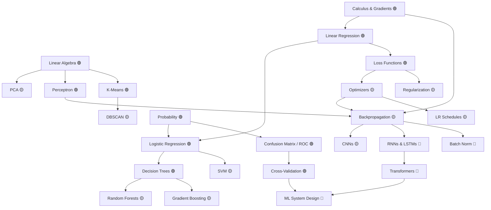

# ml-zero-to-hero

> **Every ML concept, one HTML file. Double-click it. Watch the algorithm run.**

No pip. No Jupyter. No npm. No server. **Clone the repo, double-click any `visualize.html`, and the algorithm runs in your browser** — with sliders, step-through buttons, and live annotations explaining every iteration.

Every concept is one folder with three files:

| File | What it gives you |
|---|---|
| `README.md` | Intuition → math (every symbol defined) → when it works, what breaks it → 5 interview Q&As |
| `visualize.html` | The algorithm **running**, interactively, in your browser — zero dependencies |
| `implementation.py` | The algorithm from scratch in pure standard-library Python — `python3 implementation.py` runs a demo, no installs |

---

## See it move

> **GIFs:** run each visualization, screen-record it, drop into `docs/gifs/`

| | |
|---|---|
|    **Backpropagation** — watch activations flow forward and gradients flow backward through a real network, one step at a time |    **Gradient Descent** — SGD, Momentum, and Adam race across a loss surface; click anywhere to restart them from a new point |
|    **Attention** — click a token, see exactly which words it attends to and how strongly, across multiple heads |    **K-Means** — click to place your own points, then watch centroids hunt for their clusters until convergence |
|    **Decision Tree** — the tree grows split by split while the decision boundary carves up the scatter plot in real time |    **PCA** — eigenvectors animate into place, then drag a slider to flatten the data onto its principal component |

---

## Why this exists

Every other ML learning repo either has no visuals at all, or makes you install Python, create a virtualenv, and launch Jupyter before you see anything. This one you double-click. Each concept is a single dependency-free HTML file you can run offline, the night before an interview, on any machine with a browser. That's the whole pitch.

---

## Zero to interview-ready in 60 minutes

It's 11pm, the interview is tomorrow. Open these, in this order:

1. **[docs/interview-cheatsheet.md](docs/interview-cheatsheet.md)** — 10 min. The one-page algorithm table + the 20 most-asked questions.
2. **[01_supervised/linear_regression](01_supervised/linear_regression/README.md)** — 5 min. Re-anchor on loss, fit, and the bias-variance vocabulary everything else uses.
3. **[04_training_craft/optimizers](04_training_craft/optimizers/visualize.html)** — 10 min. Run the visualization; being able to *describe* why Adam beats SGD on a ravine is a guaranteed question.
4. **[03_neural_networks/backpropagation](03_neural_networks/backpropagation/visualize.html)** — 15 min. Step through forward and backward passes until you can narrate them out loud.
5. **[03_neural_networks/transformers](03_neural_networks/transformers/README.md)** — 10 min. Attention is the most-asked deep learning topic since 2023. Click tokens until Q/K/V feels obvious.
6. **[06_system_design/ml_system_design_template.md](06_system_design/ml_system_design_template.md)** — 10 min. Memorize the template skeleton; it structures any "design a recommender" question.

---

## Full topic map

| Topic | What it is in one line | Difficulty |
|---|---|---|
| [Linear algebra](00_foundations/linear_algebra/README.md) | Vectors and matrices as *transformations of space*, not grids of numbers | 🟢 |
| [Calculus & gradients](00_foundations/calculus_and_gradients/README.md) | The gradient is an arrow pointing uphill; learning is walking the other way | 🟢 |
| [Probability](00_foundations/probability/README.md) | Quantifying uncertainty so models can say "probably" with math | 🟢 |
| [Linear regression](01_supervised/linear_regression/README.md) | Draw the best straight line through data, and *define* "best" precisely | 🟢 |
| [Logistic regression](01_supervised/logistic_regression/README.md) | Linear regression squashed into a probability for yes/no questions | 🟢 |
| [Decision trees](01_supervised/decision_trees/README.md) | A flowchart of if/else questions learned from data | 🟢 |
| [Random forests](01_supervised/random_forests/README.md) | Hundreds of slightly-wrong trees out-voting each other into being right | 🟡 |
| [SVM](01_supervised/svm/README.md) | Find the boundary with the widest possible margin between classes | 🟡 |
| [Gradient boosting](01_supervised/gradient_boosting/README.md) | Each new tree fixes the mistakes of the trees before it | 🟡 |
| [K-Means](02_unsupervised/kmeans/README.md) | Drop K pins on the data, let them drift to the middle of their crowds | 🟢 |
| [PCA](02_unsupervised/pca/README.md) | Rotate the data to find the directions where it actually varies | 🟡 |
| [DBSCAN](02_unsupervised/dbscan/README.md) | Clusters are dense neighborhoods; everything else is noise | 🟡 |
| [Perceptron](03_neural_networks/perceptron/README.md) | One neuron: weigh the inputs, add them up, fire or don't | 🟢 |
| [Backpropagation](03_neural_networks/backpropagation/README.md) | The chain rule, applied backwards, tells every weight who to blame | 🟡 |
| [CNNs](03_neural_networks/cnns/README.md) | Slide small pattern-detectors across an image and stack what they find | 🟡 |
| [RNNs & LSTMs](03_neural_networks/rnns_and_lstms/README.md) | Networks with memory: each step reads the input *and* its own past | 🔴 |
| [Transformers](03_neural_networks/transformers/README.md) | Every token looks at every other token and decides what matters | 🔴 |
| [Loss functions](04_training_craft/loss_functions/README.md) | The single number the entire training process exists to shrink | 🟢 |
| [Optimizers](04_training_craft/optimizers/README.md) | SGD, Momentum, Adam: three strategies for walking downhill | 🟡 |
| [Regularization](04_training_craft/regularization/README.md) | Deliberately handicapping the model so it stops memorizing | 🟡 |
| [Batch norm](04_training_craft/batch_norm/README.md) | Re-standardize activations mid-network so training stays stable | 🔴 |
| [LR schedules](04_training_craft/learning_rate_schedules/README.md) | Big steps early, small steps late — and why warmup exists | 🟡 |
| [Confusion matrix](05_evaluation/confusion_matrix/README.md) | The 2×2 grid behind precision, recall, and every screening-test debate | 🟢 |
| [ROC & AUC](05_evaluation/roc_auc/README.md) | How good is your classifier across *every possible* threshold at once | 🟡 |
| [Cross-validation](05_evaluation/cross_validation/README.md) | Test on data the model never saw — K different ways, to be sure | 🟢 |
| [ML system design](06_system_design/README.md) | Turning "build a recommender" into an architecture you can defend | 🔴 |

---

## What depends on what

---

## Contributing

Contributions are genuinely welcome — this repo gets better one visualization at a time.

**What a great contribution looks like:**
- **A new `visualize.html`** for a topic that doesn't have one yet. Rules: single file, zero dependencies, dark theme, at least one slider or step button, live annotations. Use [01_supervised/linear_regression/visualize.html](01_supervised/linear_regression/visualize.html) as the template.
- **A new `implementation.py`** — the algorithm from scratch, standard library only (no numpy), heavily commented, with a `__main__` demo that proves it learns. [01_supervised/linear_regression/implementation.py](01_supervised/linear_regression/implementation.py) is the template.
- **A better interview answer.** If you were asked a question in a real interview that a README here answers badly, fix the answer and say (anonymously) where it came up.
- **A GIF.** Record any visualization (10–15s, <3MB) and drop it in `docs/gifs/`.
- **A bug fix** in any visualization's math. Algorithm correctness beats prettiness.

**How:** fork → branch → PR. One topic per PR. Open an issue first for new topics so we don't duplicate work. See [CONTRIBUTING.md](CONTRIBUTING.md) for the style rules.

---

## License

MIT. Use it for anything. If it helps you pass an interview, a ⭐ is the thank-you.
